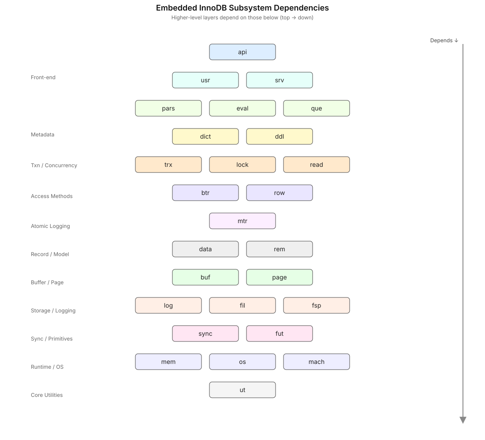

# Contribution Guidelines

## InnoDB sub projects

- **innodb**: Embedded InnoDB
- **ibdts**: *(proposal) InnoDB Deterministic Simulation Testing*
- **ibqdap**: *(proposal) InnoDB Queryplan Debug Adapter Protocol*

## C++ Code conventions

1. All iterators should be named, `it`. Example:

    ```c++
    for (auto it : map.find(key); it != map.end()) {
      // ...
    }
    ```

    If there is a possibility for name collision, bound the scope. Example:

    ```c++
    {
      auto it = name_lookup.find(key);
      // ...
    }
   
    // <awesome code here>
   
    {
      auto it = id_lookup.find(id);
      // ...
    }
   ```

2. Class/Struct names should be upper case first letter, and then snake case. Example:

    ```C++
      struct Table_dict_data;
      struct Buf_pool_manager;
    ```

3. All internal struct members should be prefixed with `m_`; Example:

   ```c++
    struct Table_dict_data {
      std::string m_name; 
      std::uint64_t m_id;
      // ....
    };
    ```

4. Tag the functions appropriately with `const`, `[[nodiscard]]`, and `noexcept` if required. Example:

    ```c++
    [[nodiscard]] bool enqueue(T const &data) noexcept;
    ```

## Embedded InnoDB

### Directory overview

- **innodb/include**: Public C++ API surface. Exported header: `innodb.h`.
- **innodb/src/include**: Centralized internal headers shared across modules.
- **innodb/src**: Internal engine implementation, organized by *subsystem* and in *topological order*:
  - **ut**: Utilities (logging, rng, sorting, primitives).
  - **mach**: Low-level machine/byte-order helpers.
  - **os**: OS abstractions (I/O, threads, sync).
  - **mem**: Memory management wrappers.
  - **sync**: Synchronization primitives (rw locks, arrays).
  - **fut**: List primitives and helpers.
  - **log**: Write-ahead logging, recovery, and IO backends (e.g., io_uring).
  - **fil**: File/space management.
  - **fsp**: Tablespace management.
  - **buf**: Buffer pool, flush, LRU, read-ahead.
  - **page**: Page format and page cursors.
  - **data**: Data field and type helpers.
  - **rem**: Record manager (record formats and comparisons).
  - **mtr**: Mini-transactions (mtr) and logging.
  - **btr**: B-tree index layer (cursors, blob handling).
  - **row**: Row operations (insert/select/update/undo/purge).
  - **trx**: Transactions, undo/rollback/XA.
  - **lock**: Lock manager (record/table locks, deadlock detection).
  - **read**: Row/page read operations.
  - **dict**: Data dictionary (load/store/types).
  - **ddl**: DDL operations.
  - **pars**: SQL parser (bison/flex grammar and lexer).
  - **eval**: Expression/procedure evaluator.
  - **que**: Query graph/executor.
  - **srv**: Server bootstrap and runtime control.
  - **usr**: Session API.
  - **api**: Public C API bridge, configuration, status helpers.
- **innodb/tests**: End-to-end tests and example clients.
- **innodb/unit-tests**: Focused unit tests for subsystems.
- **innodb/benchmarks**: Bencmark test

Proposals:

- *Module-private headers live next to sources, e.g., `src/btr/btr0*.h` or `src/btr/include/`*.

### Subsystem topology



### General setup

#### API boundaries

- Public surface: only `include/innodb.h` is installed/packaged. Everything under `src/**` (including `src/include/**`) is private.
- Who may include `innodb.h`: only code in `src/api/**` (the API bridge) and client code in `tests/**` or external users. Core engine code under `src/**` MUST NOT include `innodb.h`.
- Internal dependencies: core code includes module-local headers (e.g., `src/btr/btr0*.h`) and shared internals under `src/include/**` (e.g., `innodb0types.h`, `db0err.h`, `trx0types.h`, `que0types.h`). Prefer light `*-types.h` with forward declarations over heavy headers.
- Directionality: includes must follow the topology below. A module may only include headers from the same layer or lower layers. Upward includes (e.g., `row` including `api`) are forbidden and checked in CI.
- Public header hygiene: `include/innodb.h` must be self-contained (no private headers), use only standard library and its own declarations, and avoid leaking internal types/ABI.
- Internal header hygiene: do not include API bridge headers (`api0*.h`) from outside `src/api/**`. Avoid transitive heavy includes; include what you use (IWYU).
- Include paths: intra-module `#include "btr0btr.h"`; cross-module `#include "btr/btr0btr.h"`. Never use relative `..` includes.

#### Build system hygiene

##### CMake

- One CMake target per subsystem; only the top-level `innodb` target exposes `PUBLIC` headers.
- Per-target include dirs; avoid global `-Isrc/include`
- Clang-Tidy, Werror, and IWYU (include-what-you-use) in CI; `compile_commands.json` exported.

##### Include style

- Intra-module: `#include "btr0btr.h"` (target adds the module dir).
- Never include via relative `..` paths.

##### Tests and sanitizers

- Unit tests co-located by module (e.g., `unit-tests/btr/*`), plus end-to-end tests under `tests/`.
- Unit tests are organized by subsystem and can used any api related to the module or it's dependencies
- Integration tests, cover several subsystem and ar organized in general purpose subfolders accoring the tested process.

##### CI Build Matrix

tdb: **define/setup an Initial Build Matrix**

- Platforms:
  - Linux x86_64
  - Linux arm64
  - *macOS (arm64, x86_64): unsupported in the beginning add support later*
  - *Windows x64 (MSVC): unsupported in the beginning add support later (still works with WSL)*
- Compilers:
  - GCC: 11, 12, 13, 14+
  - Clang: 18+
- Architectures:
  - x86_64
  - arm64
- Modes:
  - Release
  - RelWithDebInfo
  - Debug
- Coverage:
  - ...
- Sanitizers (Linux/Clang or GCC):
  - ASan+UBSan (unit + selected integration)
  - TSan (selected tests; known-flaky patterns quarantined)
  - LSan (leak checks in long-running tests)
- Invariants (expensive checks):
  - Off (default for Release/RelWithDebInfo)
  - Light (enabled asserts, cheap validations)
  - Heavy (page/record/btree consistency, hazard/lock ownership) [Debug only]
- Features:
  - io_uring: ON/OFF (auto-detect on supported kernels; force OFF coverage)
  - XA: ON/OFF (`-DDISABLE_XA=OFF|ON`)
  - Unit tests: ON (`-DUNIT_TESTING=ON`)

**Matrix examples** (non-exhaustive):

- Linux-glibc x86_64, GCC13, Release, invariants: Off, io_uring: ON
- Linux-glibc x86_64, Clang17, RelWithDebInfo, ASan+UBSan, invariants: Light
- Linux-glibc x86_64, Clang17, TSan, invariants: Light, io_uring: OFF
- Linux-musl x86_64, GCC13, Release, invariants: Off
- macOS arm64, Clang, RelWithDebInfo, invariants: Off
- Windows x64, MSVC, Release, invariants: Off [if supported]
- Linux arm64, GCC13, Debug, invariants: Heavy, unit-tests only

#### Tooling gates

**TBD**: *define a tooling gates*

- `-Werror` in CI, clang-tidy on changed files, IWYU dry-run
- Build exports `compile_commands.json`; `.clangd` consumes it

#### Scheduling

**TBD**: *define a scheduling plan*

- PRs: minimal fast lanes (Release + ASan+UBSan)
- Nightly: full matrix including TSan, musl, arm64, heavy invariants, io_uring OFF
- Weekly: deep recovery/crash-restart tests and long-running durability

### InnoDB deterministic simulation testing

- Prerequisites:
  - Setup generalt testing unit tests, integration tests and benchmark tests
  - Setup test automation CI
  - **Move from threads to coros first; then from coros to worker threads/processes**
